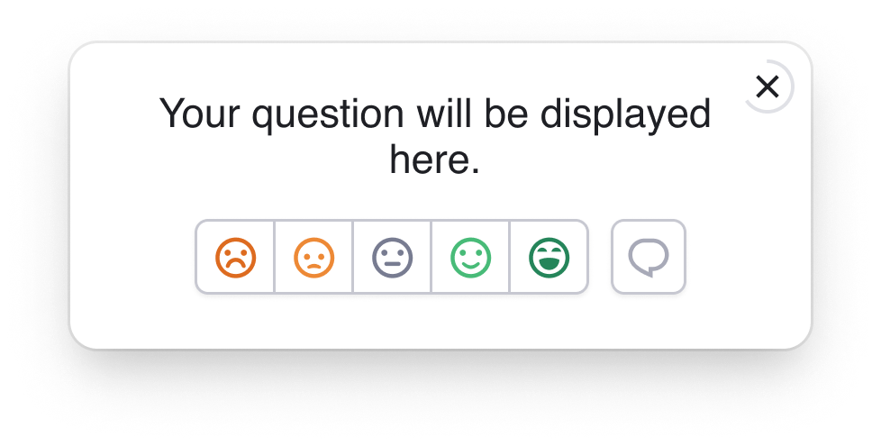
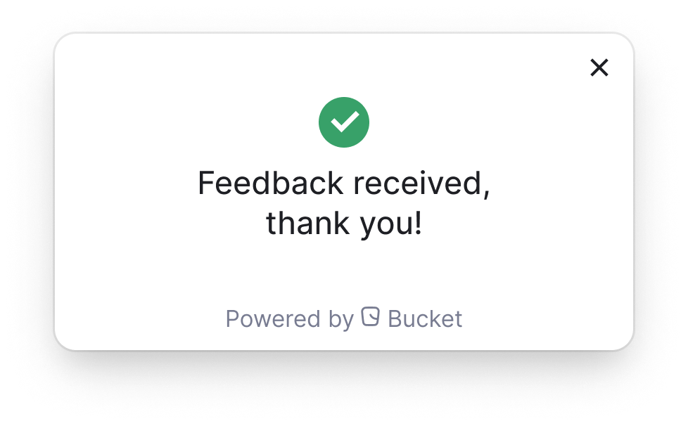

# Automated feedback surveys

Automated feedback surveys are no-code surveys that collect in-app user feedback right after a user interacts with a feature.

## Getting started

* Select the [feature](../../introduction/data-model/feature/) that you would like to start collecting feedback for
* Go to `Settings` and click on `Enable Feedback surveys`
* Enter a question in the `Prompt question` input. \
  For example: `How did you like the new Huddle feature?`
* Click the `Save` button to save your settings

<figure><figcaption></figcaption></figure>

* Test your feedback widget.
  * The `Try out` button allows you to test the feedback widget.\
    \
    Select or search for a specific user you’d like to test it on (generally yourself or another team member) and click `Trigger the prompt`.\
    \
    Make sure that you’ve enabled feedback surveys and clicked the `Save` button _before_ testing.

## Configuration

* Define the `Prompt question`
  * The question specified here will be displayed as a question to the user in the feedback widget.
* Set the `Min. interactions before triggering`
  * Defines the number of times a user needs to interact with a feature before the feedback widget is triggered.\
    \
    This lets you gather feedback from first-time users or users who used the feature multiple times.\
    \
    The value is in events. The default value is 1.
* Set the  `Min. time after interactions`&#x20;
  * Determines the duration of time before the feedback widget is displayed.\
    \
    This lets you ask the user for feedback at the most relevant time after their interaction.\
    \
    The value is in seconds. The default value is 1.
* Set the `Max. time after interactions`&#x20;
  * Defines the maximum time for the feedback widget to appear to a user after they've interacted with a feature.\
    \
    The value is in seconds. The default value is 10.

### Configure max surveys per user per period

If you've enabled surveys for multiple features, you don’t want to overload users with them.&#x20;

To configure the maximum number of surveys each user sees during a given period, do the following:

* On the sidebar, click `Settings`. Then, select `Feedback`.
* Using the `Minimum time between asking for feedback` dropdown, you can define the duration required after a survey appears before a user is asked again.&#x20;
* You can choose from 11 pre-defined delay periods ranging from 5 minutes to 3 months.\
  \
  **Delay operators**
  * `5 minutes`
  * `20 minutes`
  * `1 hour`
  * `6 hours`
  * `2 days`
  * `5 days`
  * `1 week`
  * `2 weeks`
  * `1 month`
  * `2 months`
  * `3 months`

The default value is 1 week.&#x20;

Bucket will never ask a user for feedback about the same feature more than once, regardless of the `Minimum time between asking for feedback` configuration.

## Default feedback widget behavior

In the default state, the widget will appear in the bottom right corner of your app.

Once a user interacts with the widget by providing a CSAT score, the widget will expand to give them the option to add feedback.

After a user leaves a comment and clicks `Send feedback`, the widget will display a confirmation message and automatically close.

The feedback widget will automatically close if a user doesn't interact with it.\
\
The remaining time is visualized by the circle around the `x` button. When the circle is empty, the widget will disappear.

## Customizing the feedback widget

The behavior, language, positioning, content, and design of the feedback widget are fully customizable. This lets you integrate the feedback surveys with your app while following existing UI and design guidelines.\
\
You can find the complete developer documentation [on GitHub](https://github.com/bucketco/bucket-javascript-sdk/blob/main/packages/browser-sdk/FEEDBACK.md).

Here's a glimpse of how you can tailor the feedback widget to your needs.

### Positioning

The feedback widget can be configured to be placed and behave in three different ways:

| Type         | Description                                                                                                                                                                                                                       |
| ------------ | --------------------------------------------------------------------------------------------------------------------------------------------------------------------------------------------------------------------------------- |
| **Modal**    | A modal overlay with a backdrop that blocks interaction with the underlying page. It is always centered on the page, making it the primary interface the user needs to interact with.                                             |
| **Dialog**   | A dialog appears in a specified corner of the viewport without limiting interaction with the rest of the page. It can be dismissed with a close button or will automatically disappear after a period if there is no interaction. |
| **Pushover** | A popover is anchored relative to a DOM element (typically a button). It can be dismissed by clicking outside the popover or by pressing the dedicated close button.                                                              |

Find additional positioning details in the [developer documentation](https://github.com/bucketco/bucket-javascript-sdk/blob/main/packages/browser-sdk/FEEDBACK.md#positioning-and-behavior).&#x20;

### Language

You can customize the language of the feedback widget statically at page load or dynamically during runtime.\
\
You can supply your translations by passing an object to the options to either or both of the `bucket.init(options)` or `bucket.requestFeedback(options)` calls. These translations replace the English ones used by the feedback widget.&#x20;

Find additional details about languages and translation in the [developer documentation](https://github.com/bucketco/bucket-javascript-sdk/blob/main/packages/browser-sdk/FEEDBACK.md#internationalization-i18n).

### Custom styling

The styling can be fully customized by applying custom CSS properties to your page in the CSS `:root` scope.&#x20;

More information can be found in the [developer documentation](https://github.com/bucketco/bucket-javascript-sdk/blob/main/packages/browser-sdk/FEEDBACK.md#custom-styling) and [example stylesheet](https://github.com/bucketco/bucket-javascript-sdk/blob/main/packages/tracking-sdk/dev/index.css).

### Using your UI

You can replace the existing UI with your own and intercept the standard feedback survey event to trigger your own or collect feedback manually and pass it along to Bucket.

Check out the[ developer documentation](https://github.com/bucketco/bucket-javascript-sdk/blob/main/packages/browser-sdk/FEEDBACK.md#using-your-own-ui-to-collect-feedback) for the full rundown.

### Overriding global configurations

The Bucket SDK feedback widget is configured with the following defaults:

* Positioning: Lower right-hand corner of the viewport
* Language: English
* Theme: Light mode&#x20;

These settings can be overwritten when initializing the Bucket SDK.

The [developer documentation](https://github.com/bucketco/bucket-javascript-sdk/blob/main/packages/browser-sdk/FEEDBACK.md#global-feedback-configuration) explains how.&#x20;

## Technical overview

When the[ Bucket Browser SDK](https://github.com/bucketco/bucket-javascript-sdk) is installed in your web application, browsers using your application will automatically open and maintain a connection to Bucket’s servers through a real-time server-sent events connection.

This allows the installed SDK to react to any events that are sent to Bucket, even events you send through other means, for example, from your servers.&#x20;

When a user triggers an event tracked by a feature, Bucket may determine the `Min. interactions before triggering` event threshold has been surpassed and prompt the user for feedback. If so, the Bucket service will send a request to the SDK instance.&#x20;

By default, this request will open up the Bucket feedback widget in the user's browser through the real-time connection.

The live connection for automated feedback is established once you have initialized the BucketClient
